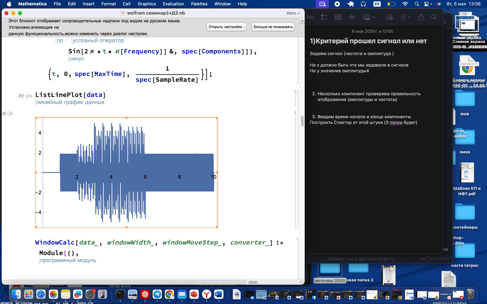

# meteor_2025
---

# Анализ синусоидальных сигналов

## 1. Задание сигнала

Задаём **сигнал**, определяя:
- Частоты
- Амплитуды

### Визуализация

- По оси **X**: то, что мы задавали в сигнале (частоты)
- По оси **Y**: амплитуда

---

## 2. Проверка компонентов

Проверяем корректность **амплитуд** и **частот** для нескольких синусоидальных компонентов.

---

## 3. 

- Указываем время начала и конца компоненты
- Строим **спектр** сигнала для этой штуки
- Ожидаем увидеть **3 пики** (если 3 компоненты) (Будет 3 палки)
- Проверяем соответствие амплитуд и частот

---

## 4. Оконный спектральный анализ

- Усиливаем выделение компоненты, изменяя sample rate
- Визуализируем результат с помощью `ListDentesPLOT`

### 4.1 Выделение компоненты (Extractor)

Реализуем 3 метода экстракции:
- `extract_cut()` — простое обрезание
- Проверяем, что компонент **появляется и исчезает** в заданное время

### 4.2 Загуливание "хвостов"

- 4.2.1: Исследуем поведение различных экстракторов (как ведут себя края)
- 4.2.2: Разрабатываем сглаживающую функцию для обрезки

### 4.3 Параметризация окна

- Функция `WindowConvert()` принимает функцию экстракта как аргумент
- Визуализируем:
  - обычный спектр
  - 3D спектрограммы
  - другие виды отображений

### 4.4 Увеличиваем перепады в сигнале

- Создаём более резкие переходы в частоте или амплитуде

### 4.5 Частота + амплитуда

- Меняем не только амплитуду, но и **частоту**
- Пример сигнала: `sin(sin(x))`
- Ожидаем **плавный переход от 5 до 10 Гц**
- Результат: спектрограмма с синусообразной красной линией

---

## 5. Создание ядра и корреляция

### 5.0 Масштабируемое ядро

- Создаём синусоиду — **ядро**
- Масштабируем по:
  - времени (ось X)
  - амплитуде (ось Y)

### 5.1 Корреляция с ядром

- Используем **коэффициент корреляции Пирсона**
  - `+1`: сонаправленные сигналы
  - `-1`: противоположные
  - `0`: нет связи
- Возможна нормировка по модулю: `[-1, 1]` без учёта масштаба
- Ищем участки сигнала, коррелирующие с ядром

**Критерий**: картинка должна совпадать с анализом из пункта 4

#### 🔁 Альтернатива:

- Визуализируем **период** вместо частоты по оси Y

---

## 6. Равная амплитуда, разные частоты

- Формируем сигнал из суммы синусов:
  - Все амплитуды одинаковы
  - Частоты разные

### ➕ Применение фильтров

- Строим спектр
- Применяем:
  - **Low-pass filter**
  - **High-pass filter**
  - **Band-pass filter**

📌 _Подсказка: почитать про эти фильтры в контексте обработки сигналов_

---

## 📎 Дополнительно

- Минимум усложнений: одна проверка — одна фича
- Визуализации — обязательны
- Проверка всех ключевых характеристик:
  - Появление/исчезновение компоненты
  - Частота / амплитуда
  - Эффективность выделения

