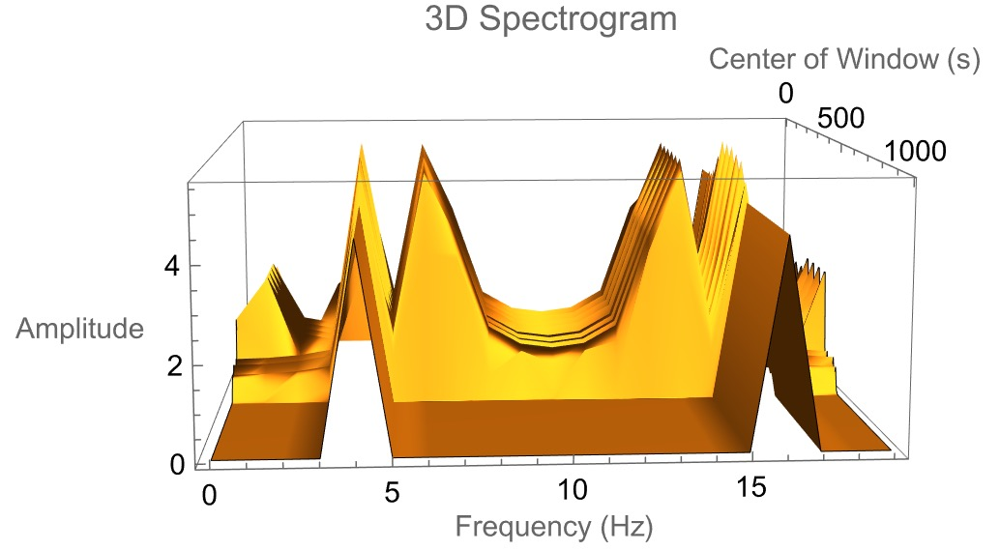

# meteor_2025
---

# Анализ синусоидальных сигналов

## 1. Задание сигнала

Задаём **сигнал**, определяя:
- Частоты
- Амплитуды

### Визуализация

- По оси **X**: то, что мы задавали в сигнале (частоты)
- По оси **Y**: амплитуда

---

## 2. Проверка компонентов

Проверяем корректность **амплитуд** и **частот** для нескольких синусоидальных компонентов.

---

## 3. 

- Указываем время начала и конца компоненты
- Строим **спектр** сигнала для этой штуки
- Ожидаем увидеть **3 пики** (если 3 компоненты) (Будет 3 палки)
- Проверяем соответствие амплитуд и частот


---

## 4. Оконный спектральный анализ

- на примере этого сигнала надо его обрезать и увеличить sample rate


- Визуализируем результат с помощью `ListDentesPLOT`

- Выполнить 3 разных метода по выделению куска сигнала (функция экстрактор)

### 4.1 Выделение компоненты Cut

- Компоненты у сигнала работает в заданном временном промежутке (это тут проверям)
- Хочу увидеть, что компонента появляется и гаснет в нужно время
- Экстракт - извлечения куска из полного сигнала 
- Не усложняем сигнал (За одну проверку проверяю одну фичу )
  
### 4.2 Загуливание "хвостов"

- 4.2.1: Исследуем разных функции Экстракта (хвосты зануляем)
- 4.2.2: Придумываем как обрезать (сглаживающую функцию)

### 4.3 Параметризуем функцию (WindowConvert)

- Функция `WindowConvert()` принимает функцию экстракта как параметр
- Визуализируем:
  - обычный спектр
  - 3D спектрограммы
  - другие виды отображений

### 4.4  3d и все остальные спектрограммы

- И сделать больше перепад

### 4.5 Частота + амплитуда

- Меняем не только амплитуду, но и **частоту** ((линейно и тд))
- Пример сигнала: `sin(sin(x))`
- Ожидаем **плавный переход от 5 до 10 Гц**
- Результат: спектрограмма с синусообразной красной линией

---

## 5. Создание ядра и корреляция

### 5.0 Масштабируемое ядро

- Создаём синусоиду — **ядро**
- Масштабируем по:
  - времени (ось X)
  - амплитуде (ось Y)

### 5.1 Корреляция с ядром

- Используем **коэффициент корреляции Пирсона**
  - `+1`: сонаправленные сигналы
  - `-1`: противоположные
  - `0`: нет связи
- Возможна нормировка по модулю: `[-1, 1]` без учёта масштаба
- Ищем участки сигнала, коррелирующие с ядром

**Критерий**: картинка должна совпадать с анализом из пункта 4

#### 🔁 Альтернатива:

- Визуализируем **период** вместо частоты по оси Y

---

## 6. Равная амплитуда, разные частоты

- Формируем сигнал из суммы синусов:
  - Все амплитуды одинаковы
  - Частоты разные
  - Чтобы у кажлрй частоты была одинаковая амплитуда 
Сумма синусов 


- Строим спектр
- Применяем:Потом применяем эти функции 
 
---

## Погуглить

- LowpassFilter
- HighpassFilter
- BandpassFilter
---

## функции для цифровой фильтрации сигналов

**LowpassFilter[data, ωc]**
Описание:
Пропускает только низкие частоты, подавляя частоты выше пороговой частоты ωc.

Аргументы:

data — список значений (сигнал)

ωc — нормализованная частота среза в диапазоне 0–1 (1 соответствует половине частоты дискретизации)

Пример:

```
LowpassFilter[signal, 0.2]
```

Назначение:
Удаление высокочастотного шума, сглаживание сигнала.


---

**HighpassFilter[data, ωc]**
Описание:
Пропускает только высокие частоты, подавляя частоты ниже пороговой ωc.

Аргументы:

data — список значений

ωc — частота среза (нормализованная, 0–1)

Пример:

```
HighpassFilter[signal, 0.4]
```

Назначение:
Удаление медленно меняющихся трендов, выделение резких изменений.

**BandpassFilter[data, {ω1, ω2}]**
Описание:
Пропускает частоты в заданном диапазоне от ω1 до ω2, блокируя всё вне этого диапазона.

Аргументы:

data — сигнал

{ω1, ω2} — диапазон пропуска (например, {0.2, 0.5})

Пример:

```
BandpassFilter[signal, {0.2, 0.5}]

```

Назначение:
Извлечение определённой полосы частот.


---
Примечания
Все ω — нормализованы относительно частоты Найквиста (fs/2), то есть:

ω = 1 → fs/2

ω = 0.5 → fs/4


